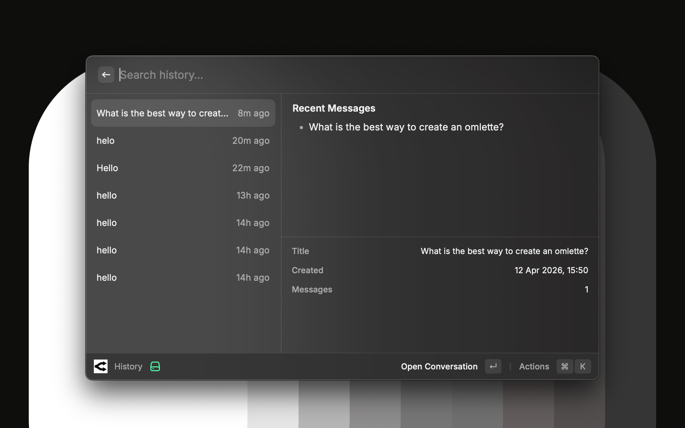

# OpenRouter for Raycast

Access any AI model supported by OpenRouter directly within Raycast. This extension provides a native interface for interacting with large language models like GPT-4o, Claude 3.5 Sonnet, and Llama 3.1, featuring real-time streaming and local conversation persistence.

## Core Capabilities

- **Unified API Access**: Interact with models from OpenAI, Anthropic, Google, Meta, and Mistral through a single OpenRouter configuration.
- **Low-Latency Streaming**: Responses are streamed word-by-word using the native Fetch API and ReadableStream for an interactive chat experience.
- **Local History**: Conversation data is stored securely on your machine via Raycast's LocalStorage, enabling you to search and resume previous chats.
- **Keyboard-First Design**: Send messages, start new chats, and manage history using standard Raycast shortcuts.
- **Model Flexibility**: Switch between models instantly by updating the Model ID in your extension settings.

## Configuration

### 1. API Key
Visit [OpenRouter Keys](https://openrouter.ai/keys) to generate an API key. 

### 2. Model ID
Enter the slug for the model you wish to use. You can find the full list of supported models at [openrouter.ai/models](https://openrouter.ai/models). Popular options include:
- `anthropic/claude-3.5-sonnet`
- `openai/gpt-4o`
- `meta-llama/llama-3.1-8b-instruct:free`

### 3. Setup Steps
1. Open the **New Chat** command in Raycast.
2. If it is your first time, you will be prompted to enter your API key and default model ID.
3. Use **`Cmd + Shift + ,`** at any time to update these preferences.

## Technical Details

- **Privacy**: No conversation data is sent to external servers other than OpenRouter.
- **Dependencies**: Built using the latest Raycast API standards with minimal external dependencies.
- **Streaming**: Implements a robust buffer management system to handle JSON fragments in network packets.

---

*This extension is an independent client for OpenRouter and requires an OpenRouter account with sufficient credits (or use of free models).*
